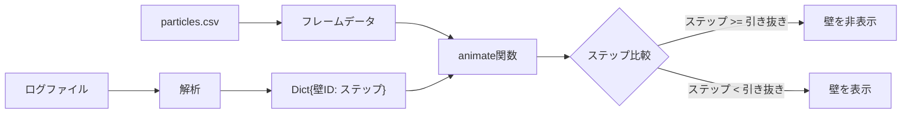

# 壁引き抜きタイミングのアニメーション反映

## 概要

ログファイルから「斜面壁 X を引き抜きました。ステップ: Y」のパターンを解析し、該当ステップ以降のフレームで対応する壁を非表示にする。

## 実装内容

### 1. ログ解析関数の追加

[`src/animate_pem.py`](src/animate_pem.py) に新しい関数を追加：

```python
def read_wall_withdraw_info(log_file: Union[str, Path]) -> Dict[int, int]:
    """ログファイルから壁引き抜き情報を読み取る。
    
    Returns:
        Dict[int, int]: {壁ID: 引き抜きステップ} の辞書
    """
```

解析対象のパターン：

- `斜面壁\s+(\d+)\s+を引き抜きました。ステップ:\s+(\d+)`

### 2. フレームデータに壁引き抜き情報を関連付け

`read_simulation_data()` の戻り値または `animate()` の引数として、壁引き抜き情報を渡せるようにする。

### 3. `animate()` 関数の修正

- 各フレームの `update_frame()` 内で、現在のステップと壁引き抜きステップを比較
- 引き抜き済みの壁に対応する `wall_lines[idx] `を `set_visible(False)` にする
- フレームデータにステップ番号を含める必要あり（現在は `time` のみ保持）

### 4. コマンドライン引数の追加

```python
parser.add_argument("--log-file", type=str, default=None, 
                    help="壁引き抜き情報を含むログファイル")
```

## データフロー



## 必要な変更箇所

| 箇所 | 変更内容 |

|------|----------|

| 新規関数 | `read_wall_withdraw_info()` を追加 |

| `read_simulation_data()` | 戻り値にステップ番号を含める（現在は既に含まれているが確認） |

| `animate()` | `wall_withdraw_info` 引数を追加、`update_frame()` 内で壁の表示制御 |

| `parse_arguments()` | `--log-file` 引数を追加 |

| `main()` | ログファイル読み込みと情報の受け渡し |