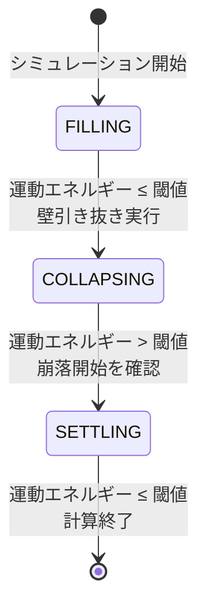

# 自動壁引き抜き・計算打ち切り機能の実装

## 概要

シミュレーションを3つのフェーズで管理する状態機械を導入し、各フェーズの遷移を運動エネルギーに基づいて自動判定します。




## 変更対象ファイル

- [`src/dem_valid.f90`](src/dem_valid.f90)

---

## 1. 新しいパラメータの追加（simulation_parameters_mod）

55-66行目付近に以下を追加：

```fortran
! 自動壁引き抜き制御パラメータ
logical :: auto_wall_withdraw = .false.         ! 自動壁引き抜きモードの有効化
integer :: simulation_phase = 1                  ! シミュレーションフェーズ (1=充填, 2=崩落, 3=再堆積)
logical :: energy_risen_after_withdraw = .false. ! 壁引き抜き後に運動エネルギーが上昇したか
real(8) :: peak_kinetic_energy = 0.0d0          ! 崩落中の最大運動エネルギー（デバッグ用）
```

---

## 2. read_input_fileへのパラメータ読み込み追加

1169行目付近の`select case`内に追加：

```fortran
case ('AUTO_WALL_WITHDRAW')
    read(line, *, iostat=ios) keyword, value
    if (ios == 0) auto_wall_withdraw = (int(value) == 1)
```

---

## 3. メインループの静止判定ロジックを修正

現在の636-652行目を以下のロジックに置き換え：

### フェーズ1: 充填段階

- `static_judge_flag == 1`（静止検出）かつ`it_step >= min_steps_before_static_check`
- 自動モード(`auto_wall_withdraw`)が有効な場合：
- 充填状態を保存
- 壁を引き抜き
- `simulation_phase = 2`（崩落段階）へ遷移
- 手動モードの場合：従来通り（`stop_when_static`なら計算終了）

### フェーズ2: 崩落段階

- 運動エネルギーが閾値を**超えた**ことを検出
- `energy_risen_after_withdraw = .true.`を設定
- `simulation_phase = 3`（再堆積段階）へ遷移

### フェーズ3: 再堆積段階

- `static_judge_flag == 1`（静止検出）
- 計算を終了

---

## 4. 具体的なコード変更

### 4.1 静止判定セクションの置き換え（636-652行目）

```fortran
! ========== フェーズ制御による静止判定 ==========
if (auto_wall_withdraw .and. enable_wall_withdraw) then
    ! 自動壁引き抜きモード
    select case (simulation_phase)
    case (1)  ! 充填段階
        if (static_judge_flag == 1 .and. it_step >= min_steps_before_static_check) then
            ! 充填完了 → 壁引き抜き
            if (.not. filled_particles_saved) then
                call save_filled_particles_sub
                filled_particles_saved = .true.
            end if
            
            ! 壁引き抜き実行
            if (withdraw_wall_id > 0) then
                select case (withdraw_wall_id)
                    case (1); left_wall_active = .false.
                    case (2); bottom_wall_active = .false.
                    case (3); right_wall_active = .false.
                    case (4); top_wall_active = .false.
                end select
                write(*,*) '自動壁引き抜き: 壁ID=', withdraw_wall_id, ', ステップ=', it_step
            end if
            if (withdraw_sloped_wall_id > 0 .and. withdraw_sloped_wall_id <= num_walls) then
                wall_active(withdraw_sloped_wall_id) = .false.
                write(*,*) '自動壁引き抜き: 斜面壁ID=', withdraw_sloped_wall_id, ', ステップ=', it_step
            end if
            wall_withdraw_done = .true.
            simulation_phase = 2  ! 崩落段階へ遷移
            write(*,*) 'フェーズ遷移: 充填 → 崩落'
        end if
        
    case (2)  ! 崩落段階（運動エネルギー上昇を待つ）
        ! 現在の運動エネルギーを取得（nposit_leapfrog_subから返す必要あり）
        if (static_judge_flag == 0) then  ! 運動エネルギー > 閾値
            energy_risen_after_withdraw = .true.
            simulation_phase = 3  ! 再堆積段階へ遷移
            write(*,*) 'フェーズ遷移: 崩落 → 再堆積（崩落開始を確認）'
        end if
        
    case (3)  ! 再堆積段階（静止検出で終了）
        if (static_judge_flag == 1) then
            write(*,*) '安息角計測完了。静止状態に到達しました。時刻: ', current_time
            write(*,*) '総ステップ数: ', it_step
            goto 200
        end if
    end select
else
    ! 従来モード（手動壁引き抜き）
    if (static_judge_flag == 1) then
        if (it_step >= min_steps_before_static_check) then
            if (enable_wall_withdraw .and. .not. wall_withdraw_done .and. .not. filled_particles_saved) then
                if (it_step < wall_withdraw_step) then
                    call save_filled_particles_sub
                    filled_particles_saved = .true.
                end if
            end if
            
            if (stop_when_static) then
                write(*,*) '静止状態に到達しました。時刻: ', current_time
                goto 200
            end if
        end if
    end if
end if
```


### 4.2 従来の壁引き抜き処理（523-549行目）の修正

自動モードでは従来の`wall_withdraw_step`ベースの処理をスキップするように条件を追加：

```fortran
! 壁引き抜き処理（手動モードのみ）
if (enable_wall_withdraw .and. .not. wall_withdraw_done .and. .not. auto_wall_withdraw) then
    if (it_step >= wall_withdraw_step) then
        ! ... 既存の壁引き抜きコード ...
    end if
end if
```

---

## 5. inputファイルでの使用例

```javascript
# 自動壁引き抜きモード（推奨）
ENABLE_WALL_WITHDRAW        1
AUTO_WALL_WITHDRAW          1
WITHDRAW_WALL_ID            2      # 引き抜く壁（1=左,2=下,3=右,4=上）

# 従来モード（互換性維持）
ENABLE_WALL_WITHDRAW        1
AUTO_WALL_WITHDRAW          0
WALL_WITHDRAW_STEP          500000  # 固定ステップ数で引き抜き
```

---

## 期待される動作

1. **充填段階**: 粒子が落下・堆積し、運動エネルギーが閾値以下になると自動的に壁を引き抜く
2. **崩落段階**: 壁引き抜きにより粒子が崩落を開始し、運動エネルギーが閾値を超えたことを確認